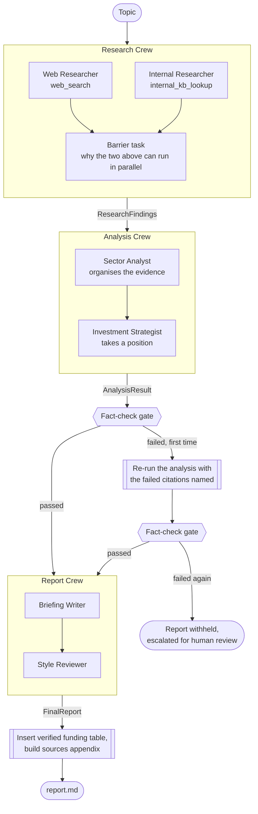

# Deep Research Agent — Northbridge Ventures

A multi-agent research pipeline built with [CrewAI](https://crewai.com). Give it
a technology sector; it researches the public web and the firm's own internal
documents in parallel, reconciles what they say, verifies every citation, and
produces an investment-committee-ready briefing.

```bash
uv run kickoff "enhanced geothermal systems"
```

```
TOPIC: enhanced geothermal systems
  research   : 15 external + 9 internal claims
  analysis   : 6 shifts, 4 companies, 4 funding events, 1 tensions, 4 recommendations
  fact-check : PASSED (43 citations verified, 0 issues, 0 revision round(s))
  cost       : $0.33 estimated
    research      $0.13  claude-sonnet-5  (42,809 in / 6,166 out, 7 requests, 11,718 cached)
    analysis      $0.09  claude-sonnet-4-5  (14,680 in / 2,271 out, 2 requests)
    report        $0.11  claude-sonnet-4-5  (12,923 in / 3,885 out, 2 requests)

  written:
    output/enhanced_geothermal_systems/research.json
    output/enhanced_geothermal_systems/analysis.json
    output/enhanced_geothermal_systems/fact_check.json
    output/enhanced_geothermal_systems/cost.json
    output/enhanced_geothermal_systems/report.json
    output/enhanced_geothermal_systems/report.md

  Should Northbridge Increase Sourcing Activity in Enhanced Geothermal Systems?
  1256 words, 17 sources, fact-check status: passed
```

That is one `uv run kickoff` invocation copied out of the terminal, not an
illustration — `output/` is checked in, so the run above is the one you are
reading:
[`output/enhanced_geothermal_systems/report.md`](output/enhanced_geothermal_systems/report.md),
alongside briefings on
[small modular reactors](output/small_modular_reactors/report.md),
[molten salt reactors](output/molten_salt_reactors/report.md),
[green hydrogen electrolyzers](output/green_hydrogen_electrolyzers/report.md) and
[wave and tidal energy](output/wave_and_tidal_energy/report.md), each with the
intermediate `research.json`, `analysis.json` and `cost.json` it was built
from. Re-running a topic overwrites its directory in place.

---

## The scenario

**Northbridge Ventures** is a VC firm investing in emerging energy technology.
Partners need to answer one question per sector: *is there a thesis here, is the
timing right, and where would we put capital if the answer is yes?*

The hard part isn't summarizing the news. It's that the firm **already has
opinions**, written down in old memos, and those opinions go stale. The most
valuable thing this tool produces is the moment where the firm's own prior
reasoning collides with current evidence — from a real run:

> Northbridge passed on two SMR developers **eighteen months ago** primarily
> due to regulatory-timeline risk, assuming the NRC licensing path would remain
> slow given the design certification backlog. External evidence shows the NRC
> approved **two SMR designs in a 12-month window** and rolled out fast-track
> reforms in **May 2026** under presidential mandate. The regulatory pathway has
> materially accelerated beyond what Northbridge assumed was realistic, reducing
> the timeline risk that drove the original pass.

The firm holding a stale position is only half of it. The section has to report
*disagreement*, not any interesting difference — an earlier version of this
pipeline filled it with items where external data plainly **confirmed** the
internal signal, which is agreement wearing a conflict's clothes. Both halves
of a tension are now typed and checked; see the fact-check gate below.

That finding is only possible because the internal and external halves are
researched **independently**, without either seeing the other. Otherwise you're
measuring contamination, not disagreement.

---

## Quickstart

Requires Python 3.10–3.13 and [uv](https://docs.astral.sh/uv/).

```bash
uv sync                      # installs deps, including dev group
cp .env.example .env         # then add your keys
```

`.env` needs:

| Variable | Required | Purpose |
| --- | --- | --- |
| `ANTHROPIC_API_KEY` | yes | every agent in the pipeline |
| `SERPER_API_KEY` | recommended | external web search ([serper.dev](https://serper.dev), free tier) |

Without `SERPER_API_KEY` the run still completes using internal sources alone,
and warns you that it did. Without `ANTHROPIC_API_KEY` it stops immediately
rather than failing a minute in.

```bash
crewai run                                    # default topic
uv run kickoff "enhanced geothermal systems"  # any topic
uv run kickoff --list-topics                  # from demo_topics.json
uv run plot                                   # flow diagram -> diagrams/
uv run pytest                                 # 233 tests, no API calls
```

Output lands in `output/<topic>/`: `research.json`, `analysis.json`,
`fact_check.json`, `cost.json`, `report.json`, `report.md` — written on every
path, including when the run escalates or crashes part-way.

**Exit codes:** `0` report produced · `2` escalated for human review (the safety
machinery working, but no deliverable) · `1` crashed.

---

## How it works



Rectangles are agents. **Hexagons and double-bordered boxes are plain Python** —
the fact-check gate, the revision hand-back, and the assembly of the funding
table and sources appendix never touch a model.

A CrewAI **Flow** orchestrates three **Crews**. Every boundary between them is a
typed Pydantic model ([`models.py`](src/crewai_exec_deep_research_agent/models.py)) —
no free text crosses a seam unchecked, which is what makes the fact-checking and
deterministic formatting possible.

### The fact-check gate

Every claim gathered gets an index. Every market shift, company profile,
funding event, tension, and recommendation must cite the indices of the claims
supporting it — every cited field in the schema, with no exceptions.
The gate is
[plain Python](src/crewai_exec_deep_research_agent/tools/citation_check_tool.py) —
deliberately **not** an agent, because the thing deciding whether a report is
trustworthy shouldn't be the same kind of process that could hallucinate.

Four checks, in rising order of how much the structure buys:

1. **Indices resolve.** A citation pointing at a claim that doesn't exist is a
   hard fail. Cheap, and catches the worst case.
2. **Something cited is actually related**, measured on terms that are *rare
   within this run's own claims*. Counting any shared word at all made this a
   topic detector rather than a relevance test: every claim in a run is about
   one sector, so an arbitrary claim paired with an arbitrary entity cleared it
   87% of the time.
3. **Anything that names a company cites evidence about it.** Vocabulary
   overlap cannot tell an entity's own evidence from a competitor's; naming is
   the one thing that evidence has to do. Which parts of a name identify it is
   decided by how rare they are in the corpus, so `fervo` and `nuscale` count
   while `energy` and `power` don't — no per-sector stoplist to maintain. This
   covers company profiles, funding events, and any recommendation that names a
   profiled company; a recommendation naming nobody skips it rather than
   failing.
4. **A tension cites internal *and* external claims, of the types it says.**
   "Where Sources Disagree" used to cross the crew boundary as free text, which
   made it the one cited section the gate couldn't see at all. As a typed
   `Tension` with the citations split by side, "internal sources say X" built
   out of external claims becomes a hard fail — a check that is only possible
   because the schema separates the two halves.

On failure the Flow feeds the specific problems back for one bounded revision;
if that fails too, it **withholds the report** and escalates with the failed
citations named.

### What is deliberately not done by an LLM

This is the through-line of the whole design. If Python can guarantee it, an
agent doesn't get to touch it:

| Thing | Why |
| --- | --- |
| Citation verification | An LLM checking an LLM's citations is theatre |
| Sources appendix | Built from the verified claim list, so every listed source provably backed a claim |
| Funding table | Rendered from structured data — a model asked to reproduce one instead rewrote it, reporting a round in the wrong currency |
| Merging parallel results | List concatenation; an LLM adds cost, latency, and a chance to silently drop a claim |
| `fact_check_status` | Read from the gate, not from an agent's opinion of its own work |
| Unwrapping fenced JSON | A rejection makes CrewAI re-run the whole agent loop; extracting the payload is a string operation |

Agents write prose and exercise judgment. Everything else is code.

---

## What's mocked

Per the brief, internal sources are static files:
[`knowledge/internal_docs/`](knowledge/internal_docs/) holds five documents — an
advanced-nuclear investment thesis, a geothermal diligence memo, wave-energy
scouting notes, a portfolio check-in, and a quarterly sector scan.

Both retrieval tools sit behind stable CrewAI tool interfaces, so swapping the
mock for a real backend doesn't touch a single agent or task config:

- [`internal_kb_tool.py`](src/crewai_exec_deep_research_agent/tools/internal_kb_tool.py)
  — keyword retrieval over the mock corpus. Replace the internals with
  Confluence, SharePoint, or a vector store over deal memos.
- [`web_search_tool.py`](src/crewai_exec_deep_research_agent/tools/web_search_tool.py)
  — Serper.dev. Replace with Tavily, Bing, or anything else.

Every tool failure returns an explicit message telling the agent what broke and
instructing it not to fabricate — never a silent empty result. A missing
knowledge base and a genuine "the firm has no prior work here" produce
*different* messages, because conflating them lets a broken deployment
masquerade as a research finding.

---

## Cost

Every run prices itself, per stage, in the summary above and in
`output/<topic>/cost.json`. Rates are Anthropic list prices verified
2026-08-21; the figure is an estimate, not a bill — it cannot see negotiated
discounts.

| Stage | Model | Rate (in/out per MTok) | Typical |
| --- | --- | --- | --- |
| research | `claude-sonnet-5` | $2 / $10 | $0.13 |
| analysis | `claude-sonnet-4-5` | $3 / $15 | $0.09 |
| report | `claude-sonnet-4-5` | $3 / $15 | $0.11 |
| **total** | | | **~$0.33** |

**Research dominates, and the reason is structural.** An agent loop resends its
entire accumulated conversation on every iteration, so a stage making N tool
calls pays input tokens proportional to N², not N. Everything about cost here
follows from that.

It started at **$0.49**, and two fixes took it to $0.31 — research input tokens
fell 116k → 34k. (It has since drifted up to ~$0.33: the analysis and report
prompts grew when "Where Sources Disagree" was given a checkable structure.
Research, the expensive stage, is untouched.)

- **The search instruction contradicted itself.** It asked for "4-6 SEPARATE,
  NARROW searches" and then required six numbered angles of coverage. Six
  angles cannot fit in 4-6 searches, and the model resolved the conflict in
  favour of coverage — correctly. Both research tasks now tie their budget to
  their angle list with an explicit ceiling. Searches fell 25 → 8.
- **Guardrail rejections re-run the entire task.** CrewAI answers a failed
  guardrail with `agent.execute_task(...)` — a fresh loop that repeats every
  tool call. A measured run paid for two extra rounds of web searches to fix
  output that was already valid apart from a markdown fence.
  [`json_salvage.py`](src/crewai_exec_deep_research_agent/json_salvage.py) now
  unwraps that case deterministically and hands the cleaned string back, which
  CrewAI re-exports through `output_pydantic`. It only ever unwraps — it will
  not repair truncated JSON, because inventing structure to make a parse
  succeed is how you silently lose real findings.

**Run-to-run variance is retries.** A run that trips a guardrail or fails the
fact-check costs more, and the accounting shows exactly where: one observed run
took three requests in the report stage instead of two — a single style-rule
bounce — and that stage cost $0.19 instead of its usual ~$0.11.

Two known inefficiencies, both left in deliberately and documented in
[`CLAUDE.md`](CLAUDE.md):

- The analysis and report crews **write** to the prompt cache and never read it
  back — each runs once per pipeline with two differently-prompted tasks, so
  they pay the 1.25× write premium for nothing.
- They also run the **more expensive** model. `claude-sonnet-4-5` is $3/$15
  against `claude-sonnet-5`'s $2/$10; it is there because toolless agents plus
  `output_pydantic` need a model on CrewAI's structured-output allowlist, not
  because it is the better choice.

---

## Testing

```bash
uv run pytest        # 233 tests, ~5s, no API calls
```

Everything deterministic is tested for real: citation checking, retrieval
scoring, tool error handling, every guardrail, the merges, artifact
persistence, flow routing, and — using stubbed LLMs against the real crew
config — that the two research agents genuinely overlap in time.

Several tests are regression locks on failures found only in live runs, and each
says so in its docstring. A few examples:

- A truncated response once validated into an *empty* result because a list
  field had a default, silently discarding 15 real claims.
- The citation gate once escalated a correct briefing because it demanded every
  cited claim share vocabulary with the citing text, rather than at least one.
- `FundingStage` stopped at `series_b` until a real X-energy Series D broke it.
- JSON salvage must unwrap a fenced payload but must *never* repair a truncated
  one — a test pins each direction, because "fixing" truncation is how the
  first bug on this list happened.
- The five checked-in runs are themselves a fixture: one test replays the gate
  over every saved `analysis.json`, so a tightening that would have escalated a
  briefing that really shipped fails in CI rather than on a live run.

---

## Configuration

Crews are defined in CrewAI's JSONC format — `crew.jsonc` plus one file per
agent — so prompts and wiring are readable as data:

```
crews/research_crew/
  crew.jsonc                        # 2 async research tasks + 1 sync barrier
  agents/web_researcher.jsonc
  agents/internal_researcher.jsonc
  agents/research_coordinator.jsonc # owns the barrier task, nothing else
  research_refs.py                  # project-local targets for {"python": ...} refs
  research_guardrails.py            # deterministic output validation
  research_crew.py                  # loads the crew, merges the results
```

Two CrewAI mechanics worth knowing if you extend this, both verified against the
1.15.17 source rather than docs:

- A crew **cannot end with two async tasks**. The Research Crew's two
  researchers run concurrently only because a synchronous barrier task follows
  them; both are submitted as futures before the barrier is reached.
- `{"python": ...}` references in JSONC must resolve to a module **inside the
  crew's own directory**, which is why each crew has a small `*_refs.py`
  re-exporting the real definitions.

[`CLAUDE.md`](CLAUDE.md) documents these and every other sharp edge found while
building, including the measured reason the analysis and report agents run a
different model than the research agents.

---

## Known limitations

- **Retrieval is keyword-overlap, not semantic.** It returns loosely related
  passages whenever vocabulary overlaps, so the internal researcher is
  explicitly instructed to judge relevance itself. A real deployment would put
  a vector store behind the same tool interface.
- **The weak-support heuristic is conservative by design** and still misses
  subtle mis-citations. Recommendations are the weak case: no name field like a
  profile, no source-type split like a tension. Roughly half of them do name a
  profiled company and get held to citing evidence about it, but the rest rest
  on vocabulary overlap alone, which an arbitrary claim from the same run
  clears about half the time. Tightening further trades false negatives for
  false positives, and a false positive withholds a good report.
- **Briefings run long.** The house target is 800-1100 words; recent runs ship
  1180-1350. Two separate causes, one fixed and one not. The guardrail runs on
  the style reviewer's output and the verified funding block is spliced in
  *afterwards*, so the shipped body is longer than what was checked — the
  ceiling now reserves 100 words for that, which keeps briefings under the hard
  limit but is a reserve, not a measurement. Underneath that, the prose itself
  has grown, and a round of prompt tightening did not move it: asked for 2-3
  sentences per recommendation, a live run returned four every time, and a
  "no more than a third of the body" instruction was satisfied by the *other*
  sections growing instead. The next attempt should give the recommendation
  section an absolute word budget rather than a proportional one.
- **The external researcher over-produces**, returning ~20 claims where the task
  asks for 8–15. All are well-sourced; it's a prompt-adherence gap.
- **One revision round, then escalation.** Bounded deliberately — a pipeline
  that retries forever on evidence that genuinely can't support the claims is
  worse than one that asks a human.
- **Comparison topics are not supported.** The task prompts are written for a
  single sector. Given `"small modular reactors vs molten salt reactors"` the
  pipeline ran without complaint and produced a briefing on the first half
  only, silently dropping the comparison. It should either handle two sectors
  or refuse the shape; right now it does neither.
